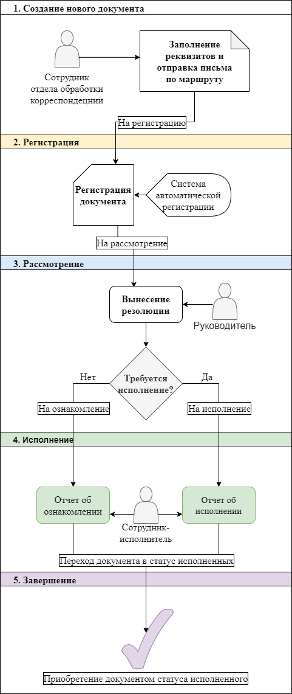

= Обработка входящего письма

anchor:bookmark-0[]*Оглавление*

* <<bookmark-a, Руководство администратора>>
* <<bookmark-b, Блок-схема>>
* <<bookmark-c, Описание процесса>>
* <<bookmark-d, Описание полей документа>>

В данном проекте реализован процесс обработки входящих писем компании – с момента получения документа до выполнения поручений, поставленных сотрудникам на его основе.

Работа с входящими письмами осуществляется посредством пользовательского веб-интерфейса системы.

anchor:bookmark-a[]*Руководство администратора*

При первом запуске доступен пользователь admin/pa$$word, который может добавлять
пользователей с ролью "Сотрудник отдела обработки корреспонденции", "Руководитель" или "Сотрудник-исполнитель".

anchor:bookmark-b[]*Блок-схема*

anchor:bookmark-c[]*Описание процесса*

На этапе 1 сотрудник отдела обработки корреспондецнии создает в системе документооборота карточку нового входящего документа и заполняет необходимые поля: дату и номер письма, имя корреспондента.

Далее документ отправляется на регистрацию, где ему в автоматическом режиме присваивается входящий номер, дата регистрации (этап 2).

На этапе 3 руководитель организации изучает документ на предмет необходимости какого-либо ответа на него и в зависимости от этого отправляет документ подчиненному на исполнение либо для ознакомления. На этом этапе в карточке документа руководителем указывается ФИО сотрудника, которому направляется входяшее письмо для рассмотрения и вид исполнения.
В случае, если документ требует исполнения, в карточке документа возможно установить срок его исполнения.

На этапе 4 сотрудник, которому было передано письмо, ставит отчет об ознакомлении с ним либо отчет об исполнении, заполнив соответствующее текстовое поле.

На этапе 5 документ приобретает статус "Исполнен", в рамках которого доступен лишь его просмотр.

anchor:bookmark-d[]*Описание полей документа*

|===
|Имя поля |Тип |Как заполняется |Примечание

|Дата
|Метка времени
|Пользователем на этапе "1"
|

|Номер письма
|Строка
|Пользователем на этапе "1"
|

|Имя корреспондента
|Строка
|Пользователем на этапе "1"
|

|Руководитель
|Строка
|Автоматически на этапе "2"
|ФИО из административной панели

|Входящий номер
|Число
|Автоматически на этапе "2"
|

|Дата регистрации
|Метка времени
|Автоматически на этапе "2"
|

|Вид исполнения
|Перечисление
|Пользователем на этапе "3"
|
|ФИО сотрудника
|Строка
|Пользователем на этапе "3"
|Из числа ФИО из административной панели

|Срок исполнения
|Метка времени
|Пользователем на этапе "3"
|Опциональное поле

|Отчет об исполнении
|Строка
|Пользователем на этапе "4"
|

|Отметка об исполнении
|Маркер
|Автоматически на этапе "5"
|
|===

* <<bookmark-0, К оглавлению>>